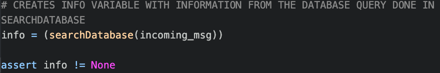
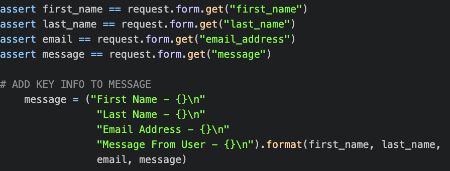

# V&V

*Group 05 – SociAll*\
*Date and location: April 18, 2021*\
*Group Members: Carter Taylor, Ethan Baranowski, Dakota Battle, Liam Scholl, Max Mosier, Quinn Melssen, William Fuertes*

## 1. Description
Over the last decade social media has exploded, and what was once a landscape that was dominated by a single company has become a warzone with tens of services all vying for space in our computers and minds. SociAll is a keychain designed to combat this phenomenon by giving users the ability to manage multiple accounts from one centralized hub. 

SociAll users will be able to access our website from any internet enabled device. Upon creating an account they will be able to sign up and become a user of the site. From there they are able to customize their profiles, as well as search for other users profiles. On the other users profiles are their SocialMedia accounts and a description of the user’s choosing. As the users browse they will also have the opportunity to follow other users and message them via the messenger if they would like. Users will also be able to text our textBot a different user’s profile name and receive a list back of their Social Media accounts.

## 2. Verification (tests)
  ## 2.1 Unit Test
  We used pytest for our unit tests since it was a little easier to implement with our source code.\
  https://github.com/cartertaylor/SociAll/tree/master/website/public/flaskApps \
  
  
  ## 2.2 Integration test
  We used pytest for our integration tests tests since it was a little easier to implement with our source code.\
  https://github.com/cartertaylor/SociAll/tree/master/website/public/flaskApps \
  
  
  ## 2.3 Acceptance
  Unfortunately, at this time, we were unable to configure a working acceptance test for our project.
  
## 3. Validation (user evaluation)
1. Script: First we want to start out with people's first impressions of the home page, followed by asking the user to go through the process of making an account. Are they a fan of the ease of use? What is your opinion on the login system and the features provided for a user? How useful do you see this product in your day to day life?” Do you have any final thoughts about the features provided and if you would change anything?

2. Results:
    1. Skyeler - Skyeler liked the page but was disappointed that the page didn't look as optimized on his 49 inch ultra wide monitor(which he says is a booming business). He also mentioned he might prefer the search bar centered on the screen rather than in the top left. Skyeler then went on to create an account. Skyeler was a huge fan of the login process. He said the process was super easy and enjoyed creating his account and then logging in. He was also a fan of updating his bio for his profile, and the color scheme we used. Afterwards he logged out and searched for his user.  When Skyeler went back home, I asked him what he thought about the navigation bar. He liked it, but thought that it would be better if the navigation bar pulled out from the left, with the search bar moving to either the middle or the right side of the page. Also maybe adding the login button to the drop down menu. The last place Skyeler visited was the contact us page, where skyeler complimented the feature and happily sent a message to our group email. Overall Skyeler really enjoyed his user experience. Besides for some of his small qualms, he really enjoyed his time. Noticing at the end the colorwave background in the background, he gave his compliments to our head designer Ethan. He could see this as a must have for anyone that uses social media. 
    2. Reese - Reese liked it and thinks that the home page was smooth. But he thought the search button was a little blocky. The font on the left below the button did not match the other fonts which he noticed. And lastly he thought that maybe the color scheme might be too bright for some people and that the login button should be moved to be higher for people to see. He gave a compliment that he thought it was a great idea for our logo to be in the top left, since that's the first place he looked on our site. Reese enjoyed the login process, and thought it was straightforward. He also liked being able to update his bio. At the end he emphasized that he would like if some of the design might be changed, and wasn't the biggest fan of black on green for the nav bar of the other pages. But with all that said, he mentioned that really thought the pages were well designed, and thought the home page in particular looked awesome. Overall he was a fan of the site though for the functionality that it provided for him. 
    3. Bryan - Bryan's first impression of the site is that he really likes the animation and the nav bar. But he would prefer if the nav bar came from the right side of the screen and thought that the search bar could be modernized and updated visually. Also he was a big fan of the designed logo. Next Bryan went ahead and created an account and said it was a solid design. For the login page Bryan logged in and was a fan of the user page. He mentioned how he would definitely be interested in using this for his twitter and other social media accounts. After heading back to the home Bryan mentioned that like Skyeler he would like the login button to be in the top right corner in addition to the normal location. The last page that he checked out was the contact us page, which he thought was a great feature to have since it actually sends us messages!
3. Reflections:
    * I think overall the answers we got from my interviews were very helpful. We got a ton of useful feedback on how we could improve the site. Some of the changes were UI based, with some conflicting responses, so we will monitor that feedback since the look of the site can often be subjective. Though we will most likely add an additional link to the login button to the nav bar to make it more readable. Additionally we will also end up adding a revamped search bar that our designer Ethan has been working on. But we were happy to hear that overall they enjoyed the site and saw it as a really well made application they would use as the features start to advance. 
