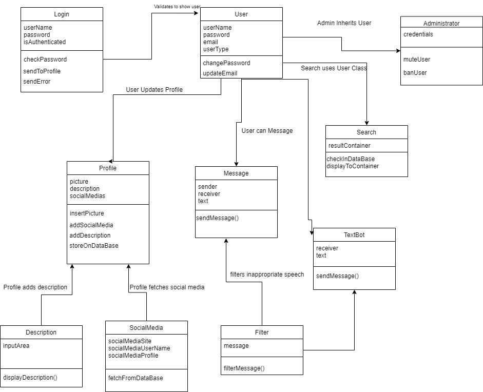

# Analysis

## 1. System description
Over the last decade social media has exploded, and what was once a landscape that was dominated by a single company has become a warzone with tens of services all vying for space in our computers and minds. SociAll is a keychain designed to combat this phenomenon by giving users the ability to manage multiple accounts from one centralized hub. 

SociAll **users** will be able to access our website from any internet enabled device. Upon creating an account they will be able to sign up and become a **user** of the site. From there they are able to customize their ***profiles***, as well as <ins>search</ins> for other **users** ***profiles***. On the other *users* ***profiles*** are their **social media** accounts and a **description** of the **user’s** choosing. As the **users** browse they will also have the opportunity to follow other users and message them via the **messenger** if they would like. 
-tbd adding small details about textbot

## 2. Model

