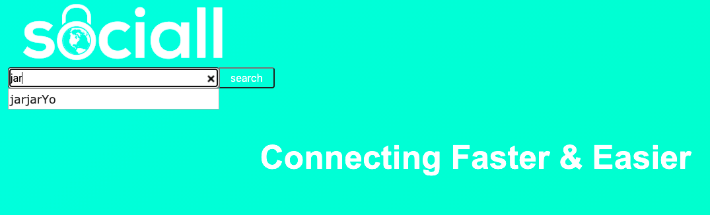
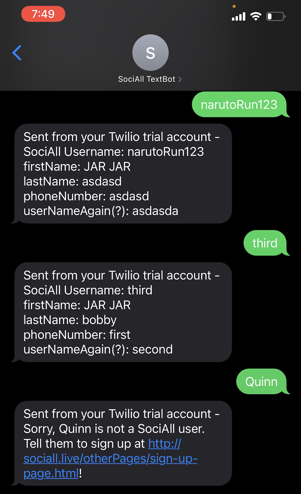

# Implementation 2

*Group 05 – SociAll*\
*Date and location: April 11, 2021*\
*Group Members: Carter Taylor, Ethan Baranowski, Dakota Battle, Liam Scholl, Max Mosier, Quinn Melssen, William Fuertes*

## 1. Introduction
Over the last decade social media has exploded, and what was once a landscape that was dominated by a single company has become a warzone with tens of services all vying for space in our computers and minds. SociAll is a keychain designed to combat this phenomenon by giving users the ability to manage multiple accounts from one centralized hub. 

SociAll users will be able to access our website from any internet enabled device. Upon creating an account they will be able to sign up and become a user of the site. From there they are able to customize their profiles, as well as search for other users profiles. On the other users profiles are their SocialMedia accounts and a description of the user’s choosing. As the users browse they will also have the opportunity to follow other users and message them via the messenger if they would like. Users will also be able to text our textBot a different user’s profile name and receive a list back of their Social Media accounts.

## 2. Implemented requirements
We worked on some core features for this release. However, only a couple of things have been finalized, we were able to complete the Search bar functionality which we can now search for Usernames in the database and it auto populates based on usernames already in the database, and we were able to complete the text a username to a phone number to get social media accounts.Other things we worked on that are not quite ready to be implemented are getting a nice theme for our website and start implementing it throughout our pages, having the ability to text a phone number and a username from SociAll to get all of their social media account names.\ 
### Search Bar Functionality
User Story Card:
https://github.com/cartertaylor/SociAll/projects/1#card-57244880 \
Pull Request:
https://github.com/cartertaylor/SociAll/pull/70 \
Who Implemented Feature: Carter Taylor\
Who Reviewed/Approved Feature: Carter Taylor\
Screenshot Of Feature:\

### Text Phone Number to Get All Social Media
User Story Card:
https://github.com/cartertaylor/SociAll/projects/1#card-57244894 \
Pull Request:
https://github.com/cartertaylor/SociAll/pull/82 \
Who Implemented Feature: Quinn Melssen\
Who Reviewed/Approved Feature: Carter Taylor\
Screenshot Of Feature:\

## 3. Demo
Demo of the website: https://drive.google.com/file/d/1u_jKXCW0XHOrXH-BxuKGqRm-42ux-AnP/view?usp=sharing \
Demo of the Text Bot: https://drive.google.com/file/d/1Iv3GZQVaEa7k4IhC89YEdLHcekZAGx_k/view?usp=sharing

## 4. Code quality
To help minimize the amount of deviance in the formatting of our code, we have opted to have small groups work on each part of the project for the majority, some of these groups being:
* Web Development Front End - This group primarily focuses on CSS, HTML, and the bootstrap framework
* Database - This group works with SQL
* Texting Bot - This group works with Python

By using such small teams, we maintain similar code formats, and by ensuring more than one person is in each team we are able to peer review to ensure all code is viable and functional before committing. After committing, our quality assurance person reviews the code for bugs and formatting errors before accepting pull requests made to the repository. The code is reviewed once more before being pushed to the live server.

Our meeting format also further ensures our code remains clean and consistent, as we spend a large majority of each meeting showing off and explaining new code to the other members of the group, resulting in even more eyes being on it. Most mistakes are neutralized by this time, but this serves as a last defense against nonfunctional or poorly formatted code.

## 5. Lessons learned
During the second release, we came to discover several things through mountains of error including the importance of designing database tables ahead of time. For weeks, issue after issue arose, almost always regarding our database. Issues with returning the proper information after it being entered persisted much longer than we expected which slowed down the pace of our development. Based on this, we also discovered the importance of preparing for a potentially inaccurate estimate of time on a specific phase of the project. Due to the extra hours of work that we had not anticipated, we had to rush to ensure that every little test we tried with our database as it correlates to login information.

In hindsight, we should not have tried to split up the work among our members by segments of code, but rather with finishing entire areas or concepts. Each week, each group member was assigned to a specific portion of the code that needed to be written or corrected. The issue brought upon us by this was that the different sections of code often were not optimal in interacting within the same system because they were not coordinated very well between members. We made this right by calling a meeting and deciding which areas needed reform, then began working on them each week for an hour or two after our group meeting concluded.
